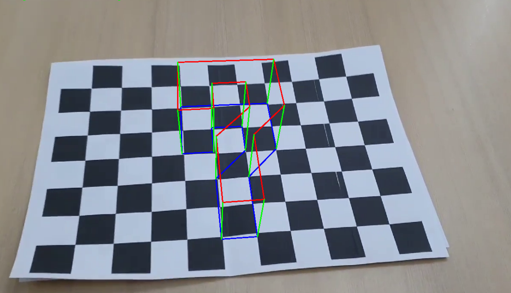

# SH_cameracalibration
가장 좋아하는 숫자 7을 표현해 보았습니다. 

* Camera matrix (K) =
[[964.75133175   0.         589.74559956]
 [  0.         968.86644961 355.22895538]
 [  0.           0.           1.        ]]
* Distortion coefficient (k1, k2, p1, p2, k3, ...) = [ 3.28625928e-01 -2.32532136e+00 -2.25880899e-03 -9.33080421e-03
  5.06864539e+00]
* 스크린샷

